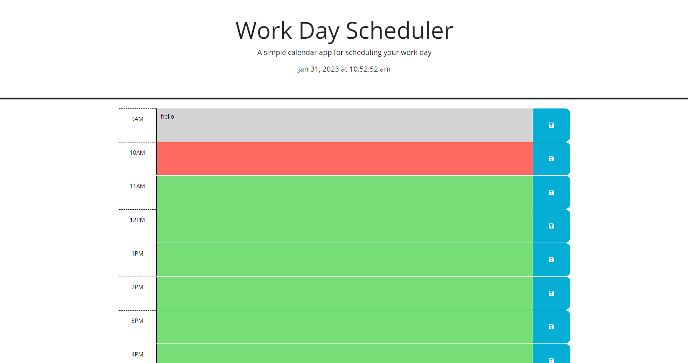
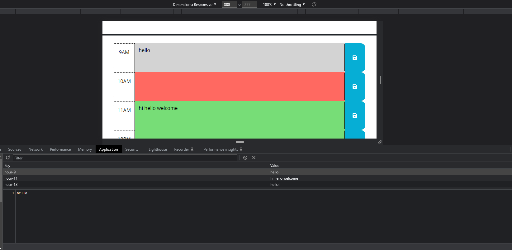

# <Work-Day-Scheduler>

## Description

The aim of the project was to add to create work day scheduler using jQuery, bootstrap and dayjs. The application is meant to display the IRL time of day, show which blocks of time are in the past, present, or future, and store the information typed within them. Through working on this project I was able to develop a better understanding of dayjs as well as jQuery. The shorthand quality of jQuery shone as I worked. I was able to figure out everything except for the function to get the appropriate colors on each block. But was able to explain exactly what the tutor taught me before they started.

## Screenshots

## Link

https://cbarnes0.github.io/Work-Day-Scheduler/